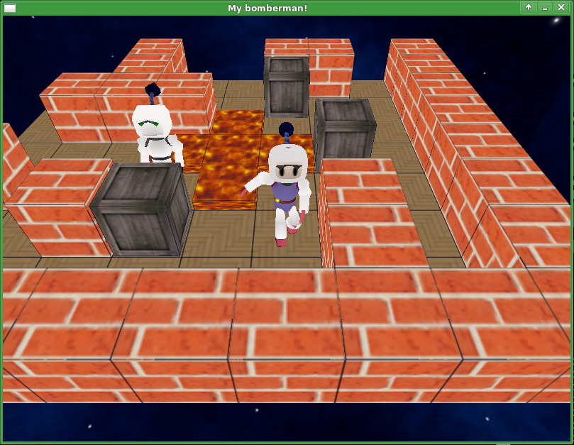
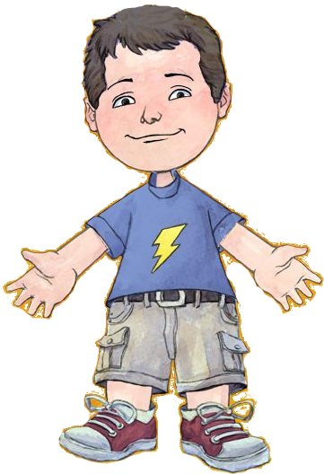
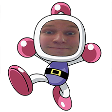

# Bomberman

## Authors

## Compilation

#### Basic :
~~~bash
$ make 
~~~

#### Maybe you prefer clang ?
~~~bash
$ make CXX=clang++
~~~
Warning: it's possible you could not compile the project with clang-3.0. Please, use clang-3.5 instead.

#### Debug or not debug :
~~~bash
$ make DEBUG=1
$ make DEBUG=0
~~~
Currently, by default DEBUG equals 1.

#### Optimizations :
~~~bash
$ make OPTI=3
~~~
This will compile with -03 (the default value).
Note: if DEBUG is enable, OPTI is ignored in order to let you debug the program correctly.

## Sound Manager

#### Format:
Musique d'ambiance : .mp3
Fx : .wav

#####Dependency :
libsdl-mixer1.2-dev

## Scripting (Lua)

#### Format:
Scripts: .lua

#### Dependency:
Lua 5.2
* ArchLinux: lua
* Debian: liblua5.2-dev

#### IA Script Skeleton
~~~lua
function initialization
  -- What to do when the script is loaded
end

function play
  -- What to do when the player by this script will play
  
  -- The scripts is provided by the following objects:
  -- Variable "me" (API::Me) represents the player by this script
  -- Variable "map" (API::Map) represents the game map
  
  print(me:getName()) -- Prints the player name
  
  local objects = map:get(me:getX(), me:getY()) -- Returns std::vector<API::GameObject>
  
  -- Browse the objects in the current player position
  for object in objects
    local x, y = object.getPosition()
    print("Object "..object.getType().." in position ".. x ..",".. y)
  end
  
end
~~~

#### J'ai fait le commit #666 ! :D
